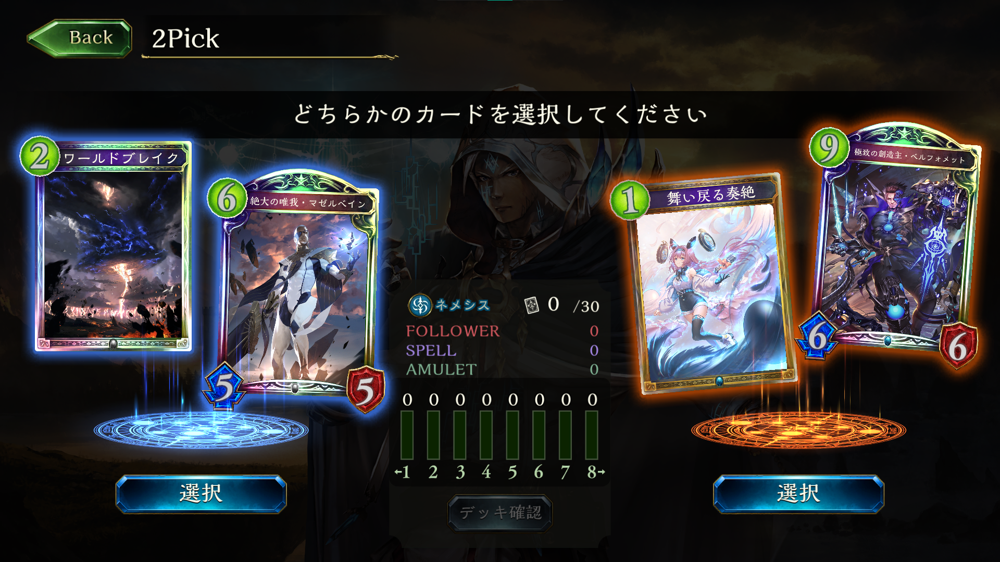

# Auto2pickChoice
※現在バグが発生しており、修正中

 シャドウバースの2pickのデッキ作成を自動化するプロジェクト。

 (シャドウバース公式サイト https://shadowverse.jp/)


完成した機能
 
 ・2pick画像選択画面のカードデータの取得。(OpenCVを使用)

 ・2pick得点表の作成。以下の攻略サイトをスクレイピング。(BeautifulSoupを使用)

 攻略サイト Gamewith https://shadowverse.gamewith.jp/article/show/83018

 ・上記の機能を組み合わせて、画面に表示されているカードの評価値の表示と左右どちらを選ぶのかをおすすめする機能を作成。(DEMOの項目で解説)

 今後作りたい機能
 
 ・ユーザー作成の2pick評価表をインポート

 ・マナカーブや特定のコンボパーツを考慮した本格的な評価関数

 ・オーバーレイでゲーム画面上に評価値を表示


# DEMO
まず初めにpresent_cards.pyを実行し、該当のクラスの番号を入力する。

クラス(リーダー)名は英語版の名称を使用。

forest:エルフ、sword:ロイヤル、rune:ウィッチ、dragon:ドラゴン、shadow:ネクロマンサー、blood:ヴァンパイア、haven:ビショップ、portal:ネメシスにそれぞれ対応している。
 ```bash
python present_cards.py
forest:0,sword:1,rune:2,dragon:3,shadow:4,blood:5,haven:6,portal:7
input craft number>>> 7
```
次に、シャドウバースを起動し、以下の画面でスペースキーを押す。
 
 すると、以下のように、カード毎の評価値と左右それぞれの評価値の合計が出力される。何度でも実行可能。
 ```bash
forest:0,sword:1,rune:2,dragon:3,shadow:4,blood:5,haven:6,portal:7
input craft number>>> 7
ワールドブレイク 8.0
絶大の唯我・マゼルベイン 7.5
舞い戻る奏絶 8.0
極致の創造主・ベルフォメット 9.5
Choice right
15.5 17.5
```
プログラムを止める際は、Ctrl+CでKeyboardInterruptを発生させる。
# Features
 
 pickleによるキャッシュにより処理を5倍程度高速化した。
 
# Requirement
shadowverse-portalはAuto2pickChoiceで使用するjsonと画像をダウンロードするために使用する。
## shadowverse-portal
 
 https://github.com/tamu1203/shadowverse-portal
## Module
 opencv-contrib-python  (4.55.62)

 tqdm   (4.62.3)

 numpy  (1.22.2)

 keyboard   (0.13.5)

 PyAutoGUI  (0.9.53)

 PyGetWindow    (0.0.9)

 beautifulsoup4 (4.10.0)

 requests   (2.27.1)

# Installation/Setup
## shadowverse-portal
```bash
python create_json.py
python dl_card_imgs.py json_ja/all.json
pip install <Library>
```
ダウンロードされたcard_imgsフォルダをAuto2pickChoice/pictures以下にコピー。

ダウンロードされたjson_jaフォルダをAuto2pickChoice直下にコピー。
## Auto2pickChoice
```bash
python descripter_cash.py
python present_cards.py
```

# Note
 Usageは上から順に作業を行う。
 
 マルチディスプレイ環境の場合は、シャドウバースはメインディスプレイに配置する。

 ## 実行環境
 Python 3.9.10
 
# License
"Auto2pickChoice" is under [MIT license](https://en.wikipedia.org/wiki/MIT_License).
